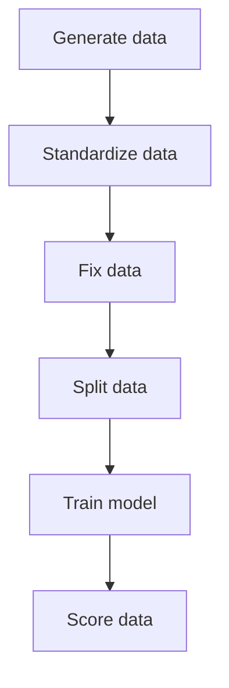

# Iris - Template Pipeline

## Overview
> [!WARNING]
> Before you start to read the text below - install pipeline's requirements. Instruction can be found in `Usage` section.

The `ml_iris` pipeline is the “Hello World” example of machine learning pipeline. It generates fake data conforming with the IRIS dataset and uses Scikit Learn to solve the problem of classification of new examples.

## Prerequisites

- [Configured environment](https://developerportal.pg.com/docs/default/component/ai_factory_general/cse_new_structure/dev_environment/).
- `USER_GITHUB_TOKEN` added to repo's secret (for GitHub Actions).
- PyrogAI installed in your virtual environment.

## Files structure

This iris pipeline adds the following files to your repository:

- `config/pipeline_ml_iris.yml`: Creates a 6 pipeline steps:
  - `generate_data` - `steps/ml_iris/iris_1_generate_data.py`
  - `standardize_data` - `steps/ml_iris/iris_2_standarize_data.py`
  - `fix_data` - `steps/ml_iris/iris_3_fix_data.py`
  - `split_data` - `steps/ml_iris/iris_4_split_data.py`
  - `train_model` - `steps/ml_iris/iris_5_train_model.py`
  - `score_data` - `steps/ml_iris/iris_6_score_data.py`

- `reqs/requirements_ml_iris.txt` - additional requirements needed by the ml_iris pipeline.
- `config/config_iris.json` - configuration file.


## Configuration Parameters

### DBR Authentication

To authenticate with Databricks, you need to generate an access token through your Databricks user profile. Follow the instructions on [how to set up your access token](https://developerportal.pg.com/docs/default/component/pyrogai/dbr-specific/how-tos/generate-dbr-token/).

Once generated, the token should be stored in `src/<project_name>/config/secrets.json`:

```json
{
    "dbr_token": "your-generated-token"
}
```

You have two options to create and store this `.json` file:

**Manually create** the `.json` file and add the secret within it.

After adding the secret, upload it to the keyvault in your resource group using Azure CLI or Azure Portal UI.

### `config_iris.json` Parameters

The  `config_iris.json` contains `ml_iris` dictionary with the following keys:

- `target`: name of predicted column
- `features`: list of feature column names
  - `sepal_length`
  - `sepal_width`
  - `petal_length`
  - `petal_width`
- `random_state`: seed
- `train_size`: part of the data intended for training data

---

No additional runtimes parameters are used with this pipeline.

## Usage

### Install requirements

After successfully downloading the pipeline, the next step is to install all required dependencies. To avoid any issues with dependencies, it is recommended to use `miniforge` and set up a fresh environment for this purpose. Install the dependencies with the command:

```sh
pip install -e ".[devel,ml_iris]"
```

### Configure `random_state` and `train_size`

By going to the file `config_iris.json` you can adjust above parameters. They can be then refered in the code by using `self.config["ml_iris"]["random_state"]` and `self.config["ml_iris"]["train_size"]`.

`random_state` is a parameter in train_test_split that controls the random number generator used to shuffle the data before splitting it. In other words, it ensures that the same randomization is used each time you run the code, resulting in the same splits of the data.

`train_size` in a machine learning workflow refers to the portion of the dataset that is used to train the model, typically represented as a percentage of the total dataset. It directly influences the model's ability to learn patterns and generalize well to unseen data, with larger train sizes often leading to more accurate models but potentially requiring more computational resources.

### Unit Testing in Your Project
When you pull your project's pipeline, you'll find the tests under the `src/<your project name>/tests/` directory. There are two main approaches to creating your own unit tests:
- Using Pyrogai Mock from the Pyrogai library
- Creating your own mock

**Approach 1: Using Pyrogai Mock**

This is the recommended method for most cases.
For documentation, refer to: [Pyrogai Mock Documentation](https://developerportal.pg.com/docs/default/Component/PyrogAI/test_mock_step/)
To see implementation examples, you can pull the `ml_iris` or `ml_skeleton` pipelines.

**Approach 2: Creating Your Own Mock**

If you prefer this method, refer to the test examples that came with your pipeline.

To get started, pull your project's pipeline and navigate to the tests directory. Choose the approach that best suits your needs and refer to the provided examples for guidance.

### Execute the pipeline

```bash
# Run locally
aif pipeline run --pipelines ml_iris

# Run on AML platform (use similar commands for the other platforms)
aif pipeline run --pipelines ml_iris --environment dev --platform AML
```
## Pipeline flow



## More information

See [how-to run ml_iris pipeline](https://developerportal.pg.com/docs/default/component/pyrogai/general-information/how-tos/pyrogai/template-pipelines/add-and-run-ml-iris-pipeline/)
