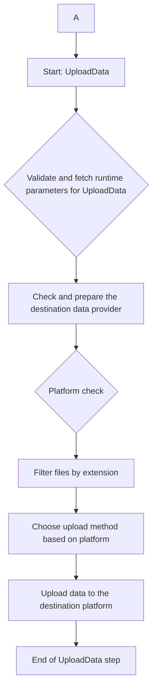

# Upload Data –- Template Pipeline

## Overview
>
> [!WARNING]  
> Before you start read text below - install pipeline requirements. In the last logs line you will find a proper command.

The `upload_data` template pipeline demonstrates how to upload data from local storage to remote storage. This pipeline can upload data to `DBR`, `Vertex`, and `AML`. It can be used in combination with the `ml_training` Pipeline.

The remote storage is chosen based on the values in the `provider` files in the `data` directory of your repository. If you have created the repository with AI Provisioner, these are pre-populated with the "correct" default location.

## Files structure

This template pipeline adds the following files to your repository:

- `config/pipeline_upload_data.yml`: Creates a 1 step pipeline:
  - `upload_data` (`steps/upload_data/upload_data.py`): Step that uploads data to the cloud, see the "usage" section below.
- `reqs/requirements_upload_data.txt`: additional requirements needed by the upload_data pipeline.
- `data/config_upload-data.json`: configuration

## Configuration Parameters

### AML Authentication

For AML (Azure Machine Learning) usage, remember to install the Azure CLI (Command Line Interface). It facilitates authentication when using `upload_data` for AML.

If you are missing the Azure CLI, use the following command for WSL (Windows Subsystem for Linux):

```bash
curl -sL https://aka.ms/InstallAzureCLIDeb | sudo bash
```

Or use this command for macOS:

```bash
brew update && brew install azure-cli
```

### DBR Authentication

To authenticate with Databricks, you need to generate an access token through your Databricks user profile. Follow the instructions on [how to set up your access token](https://developerportal.pg.com/docs/default/component/pyrogai/dbr-specific/how-tos/generate-dbr-token/).

Once generated, the token should be stored in `src/<project_name>/config/secrets.json`:

```json
{
    "dbr_token": "your-generated-token"
}
```

You have two options to create and store this `.json` file:

**Manually create** the `.json` file and add the secret within it.


After adding the secret, upload it to the keyvault in your Azure Resource Group using Azure CLI or Azure Portal UI.

### `config_upload-data.json` Parameters

The  `config_upload-data.json` contains:

- `upload_data`, contains only the `file_types` sub-key: this is a type of list[str]. Only files that match the types in this will be uploaded. E.G. ```"file_types": [
            "csv",
            "parquet"
        ]```

## Usage

### Parameters

The pipeline takes three run-time parameters which you can find here `config/pipeline_upload_data.yml`:

- `source_dir`: source directory path with the files which will be uploaded. This is relative to your working directory unless you specify a full path.
- `dest_platform`: destination platform
- `remote_dest_dir`: folder on the remote platform to which data will be copied,
  relative to the default "base" file location as defined in each provider in the repository.

You can either define these parameters in pipeline_upload_data.yml or pass them via command line.

### How to Use the Upload Data Pipeline - Step by Step Guide

To efficiently manage and automate your data upload tasks, follow these steps to utilize the `upload_data` pipeline. This guide assumes you're working within a Unix-like environment and have `miniforge` installed.

#### 1. Obtain the Pipeline

Begin by retrieving the `upload_data` pipeline template. Open your terminal and execute the following `aif` command:

```bash
aif pipeline from-template --pipelines upload_data
```

This command downloads the necessary pipeline structure to your project.

#### 2. Install Dependencies

After successfully downloading the pipeline, the next step is to install all required dependencies. To avoid any issues with dependencies, it is recommended to use `miniforge` and set up a fresh environment for this purpose. Install the dependencies with the command:

```bash
pip install -e ".[devel,upload_data]"
```

This ensures all the necessary packages are installed and ready for use.

#### 3. Configure the Pipeline

Before running the `upload_data` pipeline, ensure all necessary parameters are correctly configured in your `config/pipeline_upload_data.yml` file. This configuration step is crucial for the successful execution of the pipeline.

#### 4. Execute the Pipeline

With everything set up, you're now ready to execute the `upload_data` pipeline. Run it by entering the following command:

```bash
aif pipeline run --pipelines upload_data --environment dev
```

#### 4.a Execute the Pipeline with Parameters

There is a possibility to override your parameters from config file by adding -p into your cli command, example:

```bash
aif pipeline run --pipelines upload_data --environment dev -p dest_platform=Vertex -p source_dir=./new_source -p remote_dest_dir=somewhere_in_cloud
```

### Monitoring the `upload_data` Pipeline Execution

When you execute the `upload_data` pipeline, you'll be presented with a structured tree view of folders and files. This display is based on your specifications, determined by the `source_dir` parameter (which sets the directory to be scanned) and the file extensions you've chosen to include, as defined in your `config_upload-data.json` file.

#### Viewing the Structure Tree

Upon running the `upload_data` command, the terminal will output a visual representation of the directory structure. This includes:

- Folders and subfolders within the specified `source_dir`.
- Files that match the accepted extensions you've configured.

This tree structure helps you verify that the pipeline is scanning the correct directories and files as intended.

#### Workflow graph of pipeline



### Conclusion

By following these steps, you can streamline your data upload tasks using the `upload_data` pipeline. Remember, the key to a smooth operation is the correct setup of your environment and the precise configuration of your pipeline parameters.

### Unit Testing in Your Project
When you pull your project's pipeline, you'll find the tests under the `src/<your project name>/tests/` directory. There are two main approaches to creating your own unit tests:
- Using Pyrogai Mock from the Pyrogai library
- Creating your own mock

**Approach 1: Using Pyrogai Mock**

This is the recommended method for most cases.
For documentation, refer to: [Pyrogai Mock Documentation](https://developerportal.pg.com/docs/default/Component/PyrogAI/test_mock_step/)
To see implementation examples, you can pull the `ml_iris` or `ml_skeleton` pipelines.

**Approach 2: Creating Your Own Mock**

If you prefer this method, refer to the test examples that came with your pipeline.

To get started, pull your project's pipeline and navigate to the tests directory. Choose the approach that best suits your needs and refer to the provided examples for guidance.

## More information

See [how-to run upload_data pipeline](https://developerportal.pg.com/docs/default/component/pyrogai/general-information/how-tos/pyrogai/template-pipelines/add-and-run-upload_data-pipeline/)
